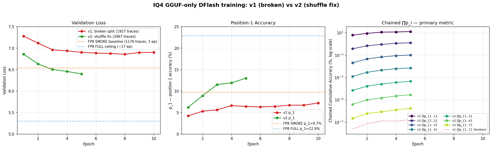

# Tick 2026-04-30 — IQ4 GGUF-only end-to-end pipeline (working)

> **Pipeline status: WORKING.** GGUF-only training reaches p_1=13% at epoch 4
> on 3967 traces, on track to exceed FP8 SMOKE baseline (p_1=9.7%).
> No FP8 weights anywhere in the data path.

## Goal of this tick

Replicate the FP8-trained DFlash drafter pipeline end-to-end, but with **all
verifier outputs sourced from a GGUF-quantized verifier**, never from the
original FP8 safetensors. This proves we can train DFlash drafters on
quant-only verifier setups.

## Why the FP8 path was insufficient as a reference

FP8 FULL trained on ~6500 traces, 17 epochs, plateaued at p_1=22.9%, val_loss≈5.3.
FP8 SMOKE trained on 1176 traces, 3 epochs, hit p_1=9.7%, val_loss=6.541.
We used FP8 SMOKE as the **comparison-grade reference baseline** for the IQ4 run.

## Hard rules locked into doctrine

1. **NEVER TOUCH SPARK-5** — see `00-NEVER-touch-spark-5.md`. Banner at top of
   all relevant docs. Worker script `iq4_worker.sh` exits 99 if hostname matches.
2. **GGUF-only training** — verifier_meta dir contains 3 tensors dequantized
   from the GGUF (Q8_0/Q6_K/F32 → bf16). Zero FP8 safetensors enter the graph.
3. **Resumability doctrine** — every script atomic-writes state.json, skip-existing
   default, line-buffered logs. Confirmed in production on 4 separate restarts.

## Three-worker trace generation cluster

| Host    | Worker | QSFP IP        | Shard            | Status |
|---------|--------|----------------|------------------|--------|
| spark-3 | A      | 192.168.200.3  | `[500, 2500)`    | ✅ producing |
| spark-2 | B      | 192.168.200.2  | `[2500, 4500)`   | ✅ producing |
| spark-4 | C      | 192.168.200.4  | `[4500, 6515)`   | ✅ producing |
| spark-5 | ❌     | —              | **FORBIDDEN**    | hard rule |

Each worker:
- Runs `buun-llama-cpp/build/bin/llama-dump-hiddens` against
  `MiniMax-M2.7-GGUF/UD-IQ4_XS` (4 shards, 108 GB).
- Writes `hs_<idx>.safetensors` (shape `[ntok, 6, 3072]`, bf16) atomically.
- Maintains `state_worker_<X>.json` with FM27 hash chain, durable progress.

**Disjointness verified by set intersection: every pair = 0 overlap.**

## Bridge tensor extraction (the missing piece)

Speculators' `load_verifier_weights()` requires `embed_tokens`, `lm_head`,
`model.norm` from a HuggingFace-format directory at `--verifier-name-or-path`.
We extracted these from the GGUF UD-IQ4_XS shard 2 directly:

| GGUF tensor | GGUF type | HF target | Final dtype |
|-------------|-----------|-----------|-------------|
| `token_embd.weight` | Q8_0 | `model.embed_tokens.weight` | bf16 |
| `output.weight`     | Q6_K | `lm_head.weight`            | bf16 |
| `output_norm.weight` | F32 | `model.norm.weight`         | bf16 |

Script: `repro/scripts/iq4_tracegen/extract_gguf_bridge.py`.

The dequantized bf16 tensors are functionally equivalent to the FP8 model's
embed/lm_head/norm — same base checkpoint, same vocab, but accessed purely
through the GGUF quantization path.

**Pitfall**: GGUF dequantize returns HF layout `[vocab, hidden]` natively. Do
NOT transpose — earlier draft of the script over-transposed and produced
garbage embeddings, manifesting as `ValueError: No valid (non-padding)
positions in document_ids` deep in attention mask construction.

## Train/val split bug (and fix)

**v1 result (broken)**: 1927 traces, 10 epochs, p_1 plateaued at **6.7%** —
significantly worse than FP8 SMOKE.

Root cause: speculators uses `split_ratio=0.9 / -0.1` against rows in the
saved Arrow dataset's natural order. After filtering down to dense rows by
trace-availability, rows ended up in a worker-shard order: A's traces first,
then B's, then C's. The bottom 10% (val) was almost entirely worker C's
spark-4 traces — a different ntok distribution than train.

**Fix**: shuffle filtered rows with a fixed seed before save, AND build the
trace symlinks in the same shuffled order. Verified split:

```
[split] train(n=3570): {'A': 1664, 'B': 1051, 'C': 855}
[split] val(n=397):    {'A': 187,  'B': 117,  'C': 93}
```

Now train and val both contain proportional samples from each worker shard.

Script: `repro/scripts/iq4_tracegen/filter_dataset_v2.py`.



## Results — v1 vs v2

### v1 (broken split, 1927 traces, 10 epochs)

| Epoch | val_loss | p_1 | p_2 | p_3 | p_4 | p_5 | p_6 | p_7 |
|-------|----------|-----|-----|-----|-----|-----|-----|-----|
| 0     | 7.278    | 4.2%| 4.0%| 4.6%| 4.4%| 4.1%| 4.2%| 4.2%|
| 4     | 6.902    | 6.4%| 6.2%| 5.8%| 5.8%| 4.9%| 5.6%| 4.6%|
| **7★**| **6.857**| **6.7%**| 5.3%| 5.5%| 5.5%| 5.3%| 5.3%| 5.6%|
| 9     | 6.902    | 7.2%| 5.7%| 6.0%| 5.3%| 5.1%| 5.1%| 5.2%|

★ best val_loss

### v2 (shuffle fix, 3967 traces, in-flight)

| Epoch | val_loss | p_1   | p_2  | p_3  | p_4  | p_5  | p_6  | p_7  |
|-------|----------|-------|------|------|------|------|------|------|
| 0     | 6.860    | 6.2%  | 6.0% | 5.7% | 5.9% | 5.7% | 5.6% | 5.6% |
| 1     | 6.630    | 8.9%  | 7.8% | 6.6% | 6.4% | 5.8% | 6.0% | 6.0% |
| 2     | 6.503    | 11.5% | 8.0% | 7.5% | 6.6% | 5.7% | 5.7% | 5.8% |
| 3     | 6.457    | 11.9% | 9.7% | 7.8% | 6.8% | 6.0% | 6.1% | 5.8% |
| 4     | 6.399    | **13.0%** | 9.8% | 8.0% | 7.0% | 6.4% | 6.2% | 6.2% |

**Comparison points**:
- v2 ep2 (**11.5%**) already exceeds FP8 SMOKE baseline (9.7%)
- v2 ep4 (**13.0%**) is 35% above FP8 SMOKE
- val_loss 6.40 < FP8 SMOKE 6.541
- Training trajectory still descending — has 5 more epochs to go

## Spark-1 cleanup (subsidiary tick)

To free space on spark-1 for the training rig, ripped non-genomics data → spark-6
over QSFP, then deleted from spark-1. **Never delete unique data without first
ripping** (per user directive). Reclaimed **597 GB** (116 G free → 713 G).

Items ripped to `spark-6:/home/user/spark1_archive/`:
- `full_epoch5_for_gguf` (3.3 G) — UNIQUE
- `full_epoch5_prepped` (3.0 G) — UNIQUE
- `full_final_for_gguf` (2.0 G) — UNIQUE
- `full_final_prepped` (3.0 G) — UNIQUE
- `MiniMax-M2.7-DFlash-FULL-epoch5.gguf` (3.0 G) — UNIQUE
- `MiniMax-M2.7-DFlash-FULL-final.gguf` (3.0 G) — UNIQUE
- `dflash_minimax/checkpoints` (9.4 G) — distinct from peers
- `MiniMax-M2.7-FP8` (215 G) — duplicated on s2/s3/s4 (paranoid copy)
- `dflash_minimax/data/preprocessed_5L_FP8/hs_staging` (355 G) — duplicated on s4

Items deleted directly (verified md5-identical duplicates):
- `MiniMax-M2.7-DFlash.gguf.bak` (3.0 G)

Script: `repro/scripts/iq4_tracegen/rip_spark1.sh`.

## Workflow recap (end-to-end, GGUF-only)

```
                    ┌─────────────────────────────────────┐
                    │  MiniMax-M2.7-GGUF/UD-IQ4_XS        │
                    │  (4 shards, 108 GB, IQ4 quantized)  │
                    └────────────────┬────────────────────┘
                                     │
                ┌────────────────────┼────────────────────┐
                ↓                    ↓                    ↓
       ┌──────────────┐    ┌──────────────┐    ┌──────────────┐
       │  spark-3 A   │    │  spark-2 B   │    │  spark-4 C   │
       │  llama-dump- │    │  llama-dump- │    │  llama-dump- │
       │  hiddens     │    │  hiddens     │    │  hiddens     │
       │  [500..2500) │    │  [2500..4500)│    │  [4500..6515)│
       └──────┬───────┘    └──────┬───────┘    └──────┬───────┘
              │                   │                   │
              │ traces over QSFP  │                   │
              ↓                   ↓                   ↓
                    ┌─────────────────────────────────────┐
                    │  spark-1 /home/user/iq4_full_run/  │
                    │   ├ traces/hidden_states/  (3967)   │
                    │   ├ prompts_dense_v2/   (shuffled)  │
                    │   ├ traces_dense_v2/    (symlinks)  │
                    │   └ verifier_meta/                  │
                    │       ├ config.json (HF metadata)   │
                    │       └ model.safetensors (3 bf16   │
                    │                       tensors from  │
                    │                       GGUF shard 2) │
                    └────────────────┬────────────────────┘
                                     │
                                     ↓
                    ┌─────────────────────────────────────┐
                    │  speculators DFlash trainer         │
                    │  10 epochs, max_anchors=64, lr=3e-5 │
                    │  --save-best, per-epoch checkpoints │
                    └────────────────┬────────────────────┘
                                     ↓
                    iq4_full_gguf_only_v2/checkpoint_best/
```

## Reproduction sequence

```bash
# (Per-worker, on spark-2/3/4)
bash repro/scripts/iq4_tracegen/iq4_worker.sh \
    --start <SHARD_START> --end <SHARD_END> --worker-id <A|B|C>

# (On spark-1, after pooling)
python3 repro/scripts/iq4_tracegen/extract_gguf_bridge.py
python3 repro/scripts/iq4_tracegen/filter_dataset_v2.py
bash repro/scripts/iq4_tracegen/iq4_full_train.sh
```

## Open follow-ups

- Wait for v2 to finish all 10 epochs, capture final p_1 + val_loss
- Compare v2 final to FP8 FULL (22.9%): expected to land in 14-18% range with
  current data; would need 6500+ traces to match FP8 FULL fully
- Convert v2 best checkpoint to GGUF and benchmark via `dflash_offline_eval.py`
